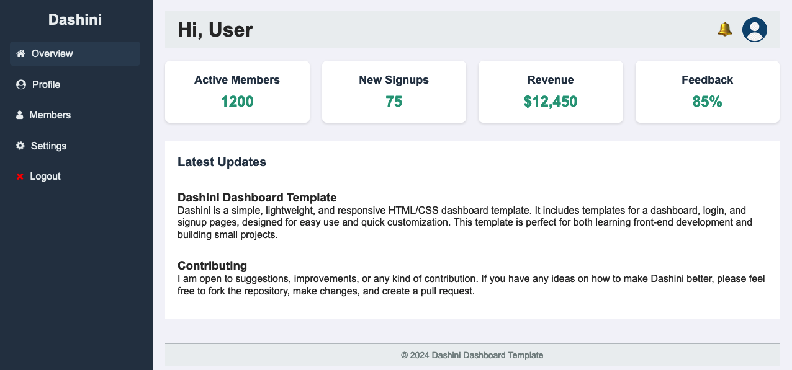

# Dashini

**Dashini** is a simple, lightweight, and responsive HTML/CSS dashboard template. It includes templates for a dashboard, login, and signup pages, designed for easy use and quick customization. This template is perfect for both learning front-end development and building small projects.



## Technologies Used
- **HTML5**
- **CSS3**
- **FontAwesome 4.7.0** (for icons)

## Features
- **Simple & Lightweight**: Dashini is designed with minimalism in mind. It has very few files, making it quick to load and easy to understand.
- **Responsive**: The template is fully responsive, ensuring it works well on both desktop and mobile devices.
- **Easy to Use & Customize**: The code is clean and well-organized, making it easy to modify according to your project’s needs.
- **Minimalist Design**: Focuses on essential features without unnecessary complexity.
- **Modular**: It includes ready-to-use templates for the dashboard, login, and signup, which can be integrated into any project.

## Benefits
- **Learning Front-End**: This template is an excellent resource for learning HTML and CSS, especially if you are starting with front-end development.
- **Quick Prototyping**: Dashini allows you to quickly prototype a dashboard or web app without worrying about complex designs.
- **Lightweight & Fast**: With minimal CSS and HTML code, Dashini ensures faster load times and better performance.
- **Mobile-Friendly**: The responsive design ensures that it looks great on all screen sizes, from phones to large desktops.

## Installation
You can simply download or clone this repository to get started:

```bash
git clone https://github.com/cedonulfi/dashini.git
```

After cloning, you can open the HTML files in your browser to view the template in action.

## Usage
To use Dashini in your project, just copy the desired HTML template and modify the CSS styles as needed. Feel free to add your custom icons or components with FontAwesome, or change the layout to suit your project.

## Contributing
I am open to suggestions, improvements, or any kind of contribution. If you have any ideas on how to make Dashini better, please feel free to fork the repository, make changes, and create a pull request.

Your feedback and contributions are highly appreciated!

## License
This template is open-source and free to use for personal and commercial projects. 

---

Thank you for checking out **Dashini**! Let's learn, improve, and share knowledge together.
